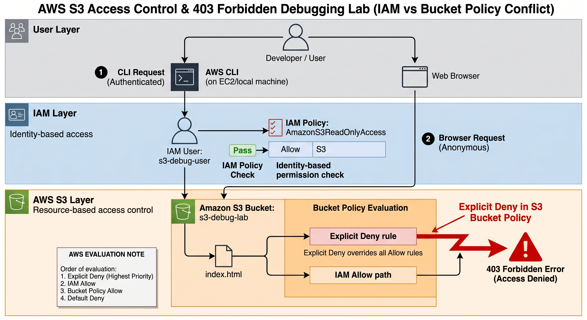
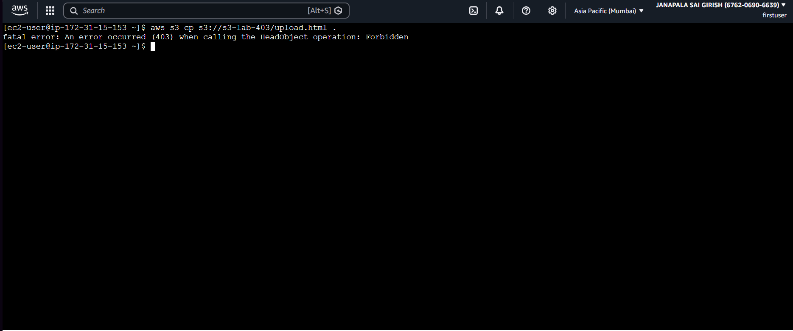
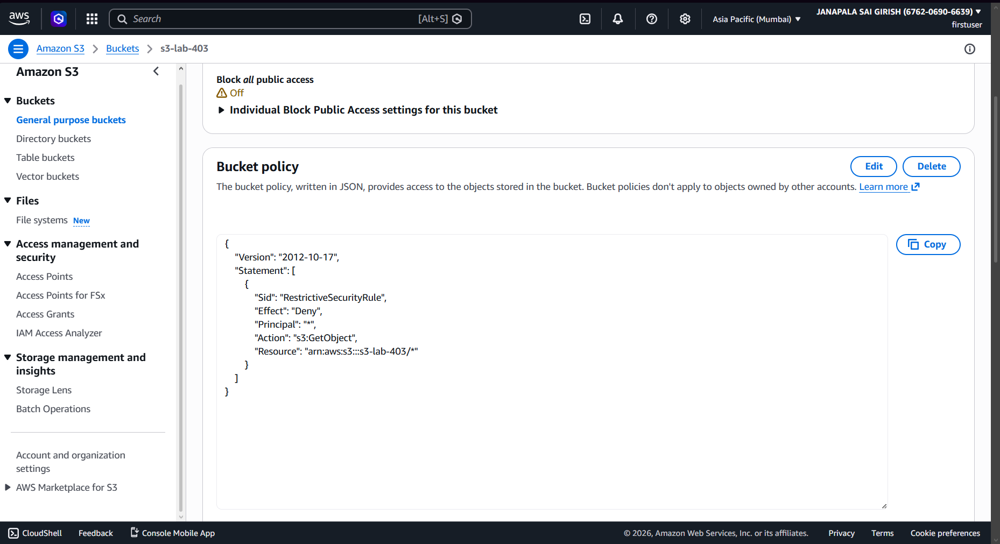
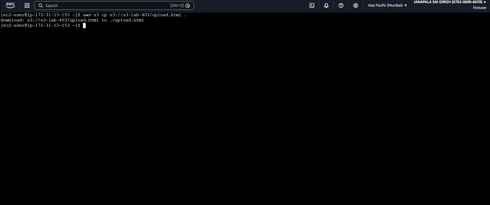

# AWS S3 Access Control & 403 Forbidden Debugging Lab (IAM vs Bucket Policy Conflict)

## 🧠 Overview

This project simulates a real AWS Cloud Support incident where an S3 object becomes inaccessible due to conflicting IAM and S3 Bucket Policy rules.

It demonstrates structured troubleshooting of **403 Forbidden (AccessDenied)** errors in Amazon S3 and explains how AWS evaluates multiple permission layers.

---

## 🎯 Objectives

* Understand AWS S3 permission evaluation model
* Compare IAM policies vs S3 Bucket Policies
* Simulate real-world 403 Forbidden incident
* Identify Explicit Deny precedence rule
* Practice structured cloud troubleshooting workflow

---

## 🏗️ Architecture

This architecture shows how a request flows through AWS permission layers:

* S3 bucket hosts `index.html`
* IAM user (`s3-debug-user`) performs authenticated CLI access
* S3 Bucket Policy applies resource-level control
* AWS CLI and Browser used as access clients

---

## 🛠️ Tools Used

* Amazon S3
* AWS IAM
* AWS CLI
* JSON Policy Editor

---

## 🟢 Phase 1: Baseline Setup (Working State)

* Created S3 bucket
* Uploaded `index.html` object
* Created IAM user with `AmazonS3ReadOnlyAccess`
* Verified successful CLI access

✔ System confirmed working before introducing failure

---

## ❌ Phase 2: Incident (403 Error Observed)

* Browser returned **403 AccessDenied**
* AWS CLI returned **403 Forbidden error**

✔ Confirms access failure at S3 authorization layer

---

## 🕵️ Phase 3: Root Cause Analysis

### Investigation Steps:

* Verified IAM permissions (correct)
* Confirmed Block Public Access was not responsible
* Inspected S3 bucket policy

### 🚨 Root Cause:

Explicit Deny in S3 Bucket Policy overriding IAM Allow permissions.

---

## ⚙️ AWS Policy Evaluation Order

1. Explicit Deny (Highest Priority)
2. IAM Allow
3. Bucket Policy Allow
4. Default Deny

---

## 🛠️ Phase 4: Resolution & Verification

* Removed or modified Explicit Deny rule in bucket policy
* Retested access using AWS CLI
* Confirmed successful file retrieval

✔ Access restored successfully

---

## 🚨 Impact

* S3 object became inaccessible via browser and CLI
* Simulated real-world production access failure scenario
* Demonstrated permission-related outage behavior

---

## 🧠 Key Learnings

* IAM and S3 Bucket Policies operate as separate permission layers
* Explicit Deny always overrides Allow rules
* 403 errors require multi-layer debugging approach
* Structured troubleshooting is essential in cloud environments
* Understanding AWS evaluation logic is critical for support roles

---

## 🚀 Outcome

This project demonstrates practical cloud support skills, including:

* Incident analysis and debugging
* Root cause identification
* IAM vs resource policy conflict resolution
* AWS permission model understanding
* Real-world troubleshooting workflow

---

## 👨‍💻 Author

AWS Cloud Learning Portfolio
Focus: Cloud Support Engineer Preparation
